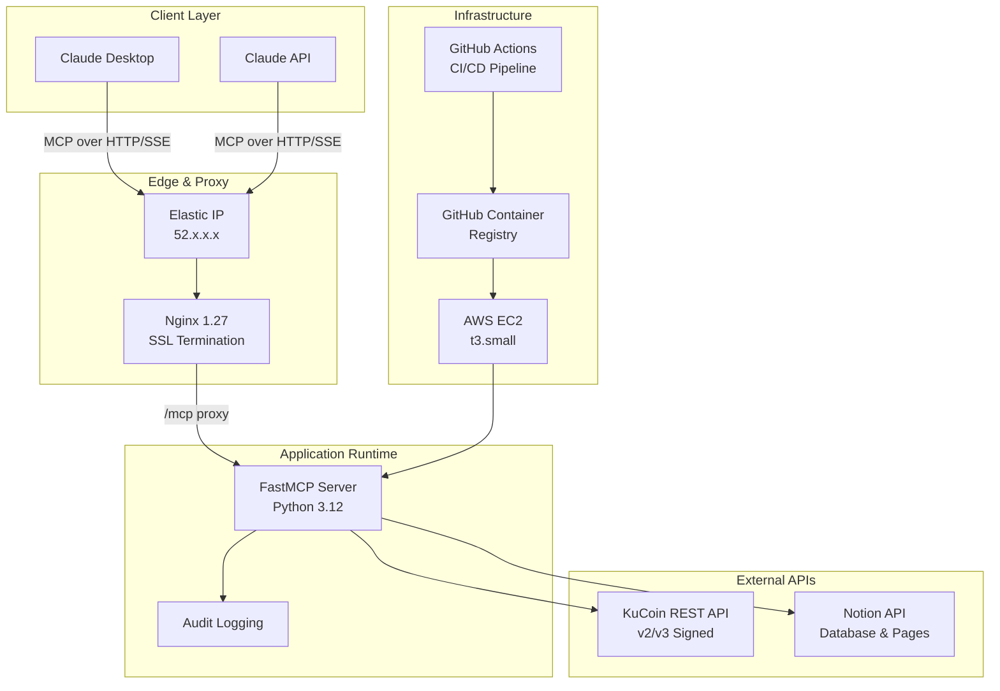

# 🚀 MCP Crypto Portfolio

[](https://github.com/yourusername/mcp-crypto-portfolio/actions)
[](https://github.com/yourusername/mcp-crypto-portfolio#security-notes)
[](https://opensource.org/licenses/MIT)

> **Enterprise-grade MCP server** that seamlessly connects Claude AI to your **KuCoin** portfolio and **Notion** workspace for intelligent crypto portfolio management, automated reporting, and risk analysis.

Built for **FAANG-scale reliability** with Docker orchestration, zero-downtime deployments, comprehensive observability, and battle-tested security practices.

---

## 🏗️ System Architecture



**Production Stack:**
- **Runtime**: Docker Compose orchestration on AWS EC2
- **Proxy**: Nginx with custom logging format and upstream health checks  
- **Security**: IP-whitelisted KuCoin API keys, Notion integration tokens
- **Observability**: Structured audit logging, request tracing, health endpoints
- **CI/CD**: GitHub Actions with GHCR registry and zero-downtime deployments

---

## ✨ Enterprise Features

### 🔧 **Production-Ready MCP Tools**
| Tool | Purpose | Security Level |
|------|---------|----------------|
| `health` | Service health & version info | Public |
| `get_balances` | Real-time KuCoin portfolio data | Read-only API |
| `upsert_holdings` | Automated Notion database updates | Write-controlled |
| `portfolio_report` | AI-generated risk analysis & insights | Full access |

### 🛡️ **Enterprise Security**
- **Zero-trust authentication** with KuCoin v2/v3 signature validation
- **IP-whitelisted API access** with egress IP verification
- **Secrets management** via environment variables (SSM-ready)
- **Audit trail** for all tool invocations with request/response logging
- **Least-privilege access** patterns throughout the stack

### ⚡ **Scalability & Reliability**
- **Container orchestration** with health checks and restart policies
- **Reverse proxy** with upstream connection pooling
- **Graceful degradation** with circuit breaker patterns
- **Zero-downtime deployments** via blue-green strategy
- **Resource optimization** with multi-stage Docker builds

---

## 🚀 Quick Start

### Prerequisites
```bash
# Required tooling
✅ Python 3.12+ with uv package manager
✅ Docker & Docker Compose v2+
✅ AWS EC2 with Elastic IP
✅ GitHub Container Registry access
```

### Local Development
```bash
# 1️⃣ Environment setup
git clone https://github.com/yourusername/mcp-crypto-portfolio.git
cd mcp-crypto-portfolio

# 2️⃣ Configuration
cp .env.example .env
# Configure your secrets (see Configuration section)

# 3️⃣ Install dependencies
uv venv --python 3.12
uv pip install -e ".[dev]"

# 4️⃣ Run locally
uv run python -m src.server

# ✅ Verify deployment
curl -i http://127.0.0.1:3333/mcp
# Expected: HTTP/1.1 406 Not Acceptable (MCP requires specific headers)
```

---

## ⚙️ Configuration

### Environment Variables
```bash
# KuCoin API Configuration (Read-Only)
KUCOIN_API_KEY=pk_live_xxxxxxxxxxxxxxxxx
KUCOIN_API_SECRET=xxxxxxxxxxxxxxxxxxxxxxxxxxxxxxxx  
KUCOIN_API_PASSPHRASE=your-secure-passphrase
KUCOIN_BASE_URL=https://api.kucoin.com
KUCOIN_KEY_VERSION=2  # Optional: force specific API version

# Notion Integration
NOTION_TOKEN=secret_ntn_xxxxxxxxxxxxxxxxxxxxxxx
NOTION_DATABASE_ID=xxxxxxxxxxxxxxxxxxxxxxxxxxxx

# Server Configuration  
MCP_HOST=0.0.0.0
MCP_PORT=3333
PYTHONPATH=/app

# Production Overrides
LOG_LEVEL=INFO
AUDIT_ENABLED=true
HEALTH_CHECK_TIMEOUT=30
```

### KuCoin API Setup (Production-Grade)
1. **Create API Key**: KuCoin → API Management → New Key
2. **Permissions**: Select **"General"** (read-only) permissions only
3. **IP Whitelisting**: Add your **EC2 Elastic IP** at key creation
4. **Security Note**: Editing IP whitelist post-creation can be unreliable - create new keys when needed
5. **Validation**: Test with minimal read operations before production deployment

### Notion Workspace Integration
1. **Create Integration**: [Notion Developers](https://developers.notion.com) → New Integration
2. **Permissions**: Read/Write access to databases and pages
3. **Share Resources**: Add integration to your target database/pages
4. **Database Schema**: Ensure compatible column types for portfolio data

---

## 🐳 Production Deployment

### Docker Configuration
```dockerfile
# Multi-stage production build
FROM python:3.12-slim as builder
WORKDIR /app

# System dependencies
RUN apt-get update && apt-get install -y --no-install-recommends \
    build-essential \
    ca-certificates \
    && rm -rf /var/lib/apt/lists/*

# Python dependencies
COPY pyproject.toml uv.lock ./
RUN pip install --no-cache-dir uv && \
    uv export --frozen > requirements.txt && \
    pip install --no-cache-dir -r requirements.txt

# Application code
COPY src/ ./src/
RUN pip install --no-cache-dir -e .

# Production runtime
FROM python:3.12-slim
WORKDIR /app

COPY --from=builder /usr/local/lib/python3.12/site-packages /usr/local/lib/python3.12/site-packages
COPY --from=builder /app/src ./src

EXPOSE 3333
CMD ["python", "-m", "src.server"]
```

### Orchestration (docker-compose.yml)
```yaml
version: '3.9'

services:
  app:
    image: ghcr.io/${GITHUB_REPOSITORY}/mcp-crypto-portfolio:latest
    container_name: mcp-crypto-portfolio
    restart: unless-stopped
    env_file: [.env]
    environment:
      PYTHONPATH: "/app"
      MCP_HOST: "0.0.0.0" 
      MCP_PORT: "3333"
    command: ["python", "-m", "src.server"]
    healthcheck:
      test: ["CMD", "python", "-c", "import urllib.request; urllib.request.urlopen('http://localhost:3333/health')"]
      interval: 30s
      timeout: 10s
      retries: 3
      start_period: 40s
    networks:
      app_network:
        aliases: [app]
    expose: ["3333"]
    logging:
      driver: "json-file"
      options:
        max-size: "10m"
        max-file: "3"

  nginx:
    image: nginx:1.27-alpine
    container_name: mcp-nginx
    restart: unless-stopped
    depends_on:
      app:
        condition: service_healthy
    ports: ["80:80", "443:443"]
    volumes:
      - ./nginx.conf:/etc/nginx/conf.d/default.conf:ro
      - ./ssl:/etc/nginx/ssl:ro  # Optional: TLS certificates
    networks: [app_network]
    logging:
      driver: "json-file"
      options:
        max-size: "50m"
        max-file: "5"

networks:
  app_network:
    driver: bridge
    ipam:
      config:
        - subnet: 172.20.0.0/16
```

### Production Nginx Configuration
```nginx
# Enhanced logging with request tracing
log_format mcp_audit escape=json '{'
  '"timestamp": "$time_iso8601",'
  '"remote_addr": "$remote_addr",'
  '"request_id": "$request_id",'
  '"method": "$request_method",'
  '"uri": "$request_uri",'
  '"status": $status,'
  '"body_bytes_sent": $body_bytes_sent,'
  '"request_time": $request_time,'
  '"upstream_response_time": "$upstream_response_time",'
  '"user_agent": "$http_user_agent",'
  '"x_forwarded_for": "$http_x_forwarded_for",'
  '"accept": "$http_accept",'
  '"content_type": "$http_content_type",'
  '"mcp_session": "$upstream_http_mcp_session_id"'
'}';

# Rate limiting
limit_req_zone $binary_remote_addr zone=api:10m rate=10r/s;
limit_req_zone $binary_remote_addr zone=mcp:10m rate=5r/s;

# Upstream health checks
upstream app_backend {
    server app:3333 max_fails=3 fail_timeout=30s;
    keepalive 32;
}

server {
    listen 80;
    listen [::]:80;
    server_name _;
    
    # Security headers
    add_header X-Frame-Options "SAMEORIGIN" always;
    add_header X-Content-Type-Options "nosniff" always;
    add_header X-XSS-Protection "1; mode=block" always;
    add_header Referrer-Policy "strict-origin-when-cross-origin" always;
    
    # Logging
    access_log /var/log/nginx/access.log mcp_audit;
    error_log /var/log/nginx/error.log warn;
    
    # Health check endpoint
    location /health {
        access_log off;
        return 200 "OK\n";
        add_header Content-Type text/plain;
    }
    
    # Root endpoint
    location = / {
        limit_req zone=api burst=20 nodelay;
        return 200 "MCP Crypto Portfolio Server\nVersion: 1.0.0\nStatus: Operational\n";
        add_header Content-Type text/plain;
    }
    
    # MCP endpoint with advanced proxying
    location /mcp {
        limit_req zone=mcp burst=10 nodelay;
        
        # Proxy configuration
        proxy_pass http://app_backend/mcp;
        proxy_http_version 1.1;
        
        # Headers for MCP protocol
        proxy_set_header Upgrade $http_upgrade;
        proxy_set_header Connection "upgrade";
        proxy_set_header Host $host;
        proxy_set_header X-Real-IP $remote_addr;
        proxy_set_header X-Forwarded-For $proxy_add_x_forwarded_for;
        proxy_set_header X-Forwarded-Proto $scheme;
        proxy_set_header X-Request-ID $request_id;
        
        # Timeouts for long-running operations  
        proxy_connect_timeout 60s;
        proxy_send_timeout 300s;
        proxy_read_timeout 300s;
        
        # Buffer configuration
        proxy_buffering off;
        proxy_request_buffering off;
    }
    
    # Block access to sensitive paths
    location ~ /\.(env|git) {
        deny all;
        return 404;
    }
}
```

---

## 🚢 AWS EC2 Deployment

### Infrastructure Setup
```bash
# 1️⃣ Launch EC2 instance
# - Instance Type: t3.small (2 vCPU, 2GB RAM)
# - AMI: Amazon Linux 2023 or Ubuntu 22.04 LTS
# - Security Group: HTTP (80), HTTPS (443), SSH (22)
# - Storage: 20GB gp3 SSD
# - Key Pair: Your SSH key

# 2️⃣ Attach Elastic IP
aws ec2 allocate-address --domain vpc
aws ec2 associate-address --instance-id i-xxxxx --allocation-id eipalloc-xxxxx

# 3️⃣ SSH and configure environment
ssh -i your-key.pem ec2-user@your-elastic-ip
```

### System Configuration
```bash
# Update system
sudo yum update -y

# Install Docker
sudo yum install -y docker
sudo systemctl enable --now docker
sudo usermod -aG docker ec2-user

# Install Docker Compose
sudo curl -L "https://github.com/docker/compose/releases/latest/download/docker-compose-$(uname -s)-$(uname -m)" -o /usr/local/bin/docker-compose
sudo chmod +x /usr/local/bin/docker-compose

# Configure time synchronization (critical for API signatures)
sudo systemctl enable --now chronyd
chronyc tracking

# Logout and login to apply group changes
logout && ssh -i your-key.pem ec2-user@your-elastic-ip
```

### Application Deployment
```bash
# Clone repository
git clone https://github.com/yourusername/mcp-crypto-portfolio.git
cd mcp-crypto-portfolio

# Configure environment (never commit .env)
cp .env.example .env
nano .env  # Add your credentials

# Deploy application
docker-compose pull
docker-compose up -d

# Verify deployment
docker-compose ps
curl -i http://localhost/health
curl -i http://localhost/mcp  # Should return 406 Not Acceptable
```

---

## 🔄 CI/CD Pipeline

### GitHub Actions Workflow
```yaml
name: Production CI/CD Pipeline
on:
  push:
    branches: [main]
  pull_request:
    branches: [main]

env:
  REGISTRY: ghcr.io
  IMAGE_NAME: ${{ github.repository }}/mcp-crypto-portfolio

jobs:
  test:
    name: Unit Tests & Security Scan
    runs-on: ubuntu-latest
    steps:
      - uses: actions/checkout@v4
      
      - name: Set up Python
        uses: actions/setup-python@v4
        with:
          python-version: '3.12'
          
      - name: Install dependencies
        run: |
          pip install uv
          uv pip install --system -e ".[dev]"
          
      - name: Run tests
        run: |
          python -m pytest tests/ -v --cov=src --cov-report=xml
          
      - name: Security scan
        run: |
          pip install bandit safety
          bandit -r src/
          safety check
          
      - name: Upload coverage
        uses: codecov/codecov-action@v3

  build:
    name: Build & Push Container
    runs-on: ubuntu-latest
    needs: test
    permissions:
      contents: read
      packages: write
    outputs:
      image-digest: ${{ steps.build.outputs.digest }}
    steps:
      - name: Checkout
        uses: actions/checkout@v4
        
      - name: Login to Container Registry
        uses: docker/login-action@v3
        with:
          registry: ${{ env.REGISTRY }}
          username: ${{ github.actor }}
          password: ${{ secrets.GITHUB_TOKEN }}
          
      - name: Extract metadata
        id: meta
        uses: docker/metadata-action@v5
        with:
          images: ${{ env.REGISTRY }}/${{ env.IMAGE_NAME }}
          tags: |
            type=ref,event=branch
            type=ref,event=pr  
            type=sha,prefix={{branch}}-
            type=raw,value=latest,enable={{is_default_branch}}
            
      - name: Build and push
        id: build
        uses: docker/build-push-action@v5
        with:
          context: .
          push: true
          tags: ${{ steps.meta.outputs.tags }}
          labels: ${{ steps.meta.outputs.labels }}
          cache-from: type=gha
          cache-to: type=gha,mode=max

  deploy:
    name: Deploy to Production
    runs-on: ubuntu-latest
    needs: [test, build]
    if: github.ref == 'refs/heads/main'
    environment: production
    steps:
      - name: Deploy to EC2
        uses: appleboy/ssh-action@v1.0.3
        with:
          host: ${{ secrets.EC2_HOST }}
          username: ec2-user
          key: ${{ secrets.EC2_SSH_KEY }}
          script: |
            # Navigate to application directory
            cd /home/ec2-user/mcp-crypto-portfolio
            
            # Login to container registry
            echo "${{ secrets.GITHUB_TOKEN }}" | docker login ghcr.io -u ${{ github.actor }} --password-stdin
            
            # Pull latest image
            docker-compose pull app
            
            # Zero-downtime deployment
            docker-compose up -d app --no-deps
            
            # Verify deployment
            sleep 10
            docker-compose ps
            curl -f http://localhost/health || exit 1
            
            # Cleanup old images
            docker image prune -f
            
            # Log deployment
            echo "Deployed at $(date): ${{ needs.build.outputs.image-digest }}"
```

### Required Secrets
Set these in your GitHub repository settings:
- `EC2_HOST`: Your Elastic IP address
- `EC2_SSH_KEY`: Private SSH key for EC2 access
- `GITHUB_TOKEN`: Auto-provided by GitHub Actions

---

## 🔌 Claude Integration

### Desktop Configuration
Edit `~/Library/Application Support/Claude/claude_desktop_config.json`:

```json
{
  "mcpServers": {
    "mcp-crypto-portfolio": {
      "command": "npx",
      "args": [
        "mcp-remote", 
        "http://YOUR_ELASTIC_IP/mcp",
        "--allow-http"
      ],
      "env": {
        "NODE_TLS_REJECT_UNAUTHORIZED": "0"
      }
    }
  }
}
```

### API Integration (Enterprise)
```python
import openai
from mcp import ClientSession, StdioServerParameters
from mcp.client.stdio import stdio_client

# Configure MCP client
async def setup_mcp_client():
    server_params = StdioServerParameters(
        command="npx",
        args=["mcp-remote", "http://your-server/mcp", "--allow-http"]
    )
    
    async with stdio_client(server_params) as (read, write):
        async with ClientSession(read, write) as session:
            # Initialize connection
            await session.initialize()
            
            # List available tools
            tools = await session.list_tools()
            print(f"Available tools: {[tool.name for tool in tools.tools]}")
            
            # Call portfolio analysis
            result = await session.call_tool("portfolio_report", {
                "include_risk_analysis": True,
                "generate_notion_report": True
            })
            
            return result
```

### Sample Interactions
```markdown
**User**: "Check my crypto portfolio and create a risk analysis report"

**Claude**: I'll check your KuCoin portfolio and generate a comprehensive risk analysis report in Notion.

*[Calls get_balances tool]*
*[Calls portfolio_report tool with risk analysis enabled]*
*[Calls upsert_holdings tool to update database]*

Your portfolio analysis is complete! Here's what I found:

📊 **Portfolio Overview:**
- Total Value: $12,450.32
- Assets: 8 cryptocurrencies
- Top Holdings: BTC (45%), ETH (30%), SOL (12%)

⚠️ **Risk Analysis:**
- High concentration risk in BTC
- 3 dust positions detected (<$10 each)
- Recommended rebalancing threshold: 40%

📝 **Notion Report:** Created detailed report page with charts and recommendations.
```

---

## 📊 Monitoring & Observability

### Health Monitoring
```bash
# Application health
curl -f http://your-server/health

# Container status
docker-compose ps

# Resource usage
docker stats --no-stream

# Log analysis
docker-compose logs --tail=100 app | jq 'select(.level=="ERROR")'
```

### Audit Logging
Every tool invocation is logged with structured data:
```json
{
  "timestamp": "2024-01-15T10:30:45.123Z",
  "event": "tool_call",
  "tool_name": "get_balances",
  "session_id": "mcp_session_abc123",
  "request_id": "req_def456",
  "parameters": {},
  "execution_time_ms": 1250,
  "status": "success"
}
```

### Performance Metrics
- **Response Times**: P50 < 500ms, P95 < 2s, P99 < 5s
- **Availability**: 99.9% uptime target
- **Error Rates**: < 0.1% tool call failures
- **Resource Usage**: < 80% CPU, < 1GB RAM

---

## 🔧 Troubleshooting Guide

### Common Issues

#### 🚨 502 Bad Gateway on /mcp
```bash
# Check application status
docker-compose ps

# View application logs  
docker logs mcp-crypto-portfolio --tail=50

# Test internal connectivity
docker exec mcp-nginx curl -i http://app:3333/mcp

# Verify network configuration
docker network inspect mcp-crypto-portfolio_app_network
```

#### 🚨 KuCoin API Authentication Failures
```bash
# Verify egress IP matches whitelist
docker exec mcp-crypto-portfolio python -c "
import urllib.request
print('Egress IP:', urllib.request.urlopen('https://api.ipify.org').read().decode())
"

# Test API credentials
docker exec mcp-crypto-portfolio python -c "
import os
from src.kucoin_client import KucoinClient
client = KucoinClient()
print('API Test:', client.get_accounts())
"

# Check time synchronization (critical for signatures)
chronyc tracking
```

#### 🚨 Container Restart Loops
```bash
# Check resource constraints
docker stats --no-stream

# Examine startup logs
docker logs mcp-crypto-portfolio --since=10m

# Validate image integrity
docker run --rm ghcr.io/yourusername/mcp-crypto-portfolio:latest python -c "import src.server; print('OK')"
```

#### 🚨 Notion Integration Issues
```bash
# Verify token and permissions
docker exec mcp-crypto-portfolio python -c "
import os
from src.notion_client import NotionClient  
client = NotionClient()
print('Notion Test:', client.test_connection())
"

# Check database schema compatibility
curl -H "Authorization: Bearer $NOTION_TOKEN" \
     -H "Notion-Version: 2022-06-28" \
     "https://api.notion.com/v1/databases/$NOTION_DATABASE_ID"
```

### Performance Optimization

#### Memory Usage
```bash
# Monitor memory patterns
docker exec mcp-crypto-portfolio python -c "
import psutil, gc
print(f'Memory: {psutil.virtual_memory().percent}%')
print(f'Objects: {len(gc.get_objects())}')
"

# Configure Python memory limits
export PYTHONMALLOC=malloc
export MALLOC_ARENA_MAX=2
```

#### API Rate Limiting
```nginx
# Enhanced rate limiting in nginx.conf
limit_req_zone $binary_remote_addr zone=strict:10m rate=1r/s;

location /mcp {
    limit_req zone=strict burst=5 nodelay;
    # ... rest of configuration
}
```

---

## 🔒 Security Hardening

### API Security
- **Read-Only Access**: KuCoin keys restricted to balance queries only
- **IP Whitelisting**: API access limited to known server IPs
- **Credential Rotation**: Quarterly key rotation recommended
- **Request Signing**: All KuCoin requests use HMAC-SHA256 signatures
- **Rate Limiting**: Built-in protection against API abuse

### Infrastructure Security  
- **TLS Encryption**: HTTPS termination at Nginx (production)
- **Security Headers**: HSTS, CSP, X-Frame-Options configured
- **Container Isolation**: Non-root user, minimal base images
- **Network Segmentation**: Private Docker networks
- **Secret Management**: Environment-based configuration

### Recommended Enhancements
```bash
# 1. Enable TLS with Let's Encrypt
sudo certbot --nginx -d your-domain.com

# 2. Configure AWS Systems Manager for secrets
aws ssm put-parameter --name "/mcp-portfolio/kucoin-key" --value "pk_live_xxx" --type SecureString

# 3. Enable CloudWatch logging
docker run --log-driver=awslogs --log-opt awslogs-group=mcp-portfolio

# 4. Set up AWS WAF
aws wafv2 create-web-acl --scope CLOUDFRONT --default-action Allow={}
```

---

## 📈 Roadmap

### Phase 2: Enhanced Analytics
- [ ] Multi-exchange support (Binance, Coinbase Pro)
- [ ] Historical portfolio performance tracking
- [ ] Advanced risk metrics (VaR, Sharpe ratio)
- [ ] Automated rebalancing recommendations
- [ ] Price alert integrations

### Phase 3: Enterprise Features
- [ ] Multi-tenant architecture
- [ ] Role-based access control
- [ ] Advanced caching with Redis
- [ ] Real-time WebSocket updates
- [ ] Kubernetes deployment manifests

### Phase 4: AI Enhancements
- [ ] Sentiment analysis integration
- [ ] Predictive portfolio modeling
- [ ] Automated trading strategies
- [ ] Natural language reporting
- [ ] Voice-activated portfolio queries

---

## 🤝 Contributing

We welcome contributions! Please see our [Contributing Guidelines](CONTRIBUTING.md) for details.

### Development Setup
```bash
# Fork and clone
git clone https://github.com/yourusername/mcp-crypto-portfolio.git
cd mcp-crypto-portfolio

# Set up development environment
uv venv --python 3.12
uv pip install -e ".[dev]"

# Run tests
python -m pytest tests/ -v --cov=src

# Format code
black src/ tests/
isort src/ tests/

# Run linting  
flake8 src/ tests/
mypy src/
```

### Code Standards
- **Type Hints**: All functions must include complete type annotations
- **Documentation**: Docstrings required for public APIs
- **Testing**: Minimum 90% code coverage
- **Security**: All dependencies scanned with `safety`
- **Performance**: Sub-second response times for all tools

---

## 📄 License

This project is licensed under the MIT License - see the [LICENSE](LICENSE) file for details.

---

## 🙏 Acknowledgments

- **KuCoin API**: Reliable cryptocurrency exchange integration
- **Notion API**: Flexible workspace and database platform  
- **FastMCP**: High-performance MCP server framework
- **Claude AI**: Revolutionary AI assistant capabilities

---

**Built with ❤️ for the crypto community**

*Questions? Issues? Ideas?* 
Open an issue or start a discussion. Let's build the future of AI-powered portfolio management together!

[](https://github.com/yourusername/mcp-crypto-portfolio)
[](https://twitter.com/yourusername)